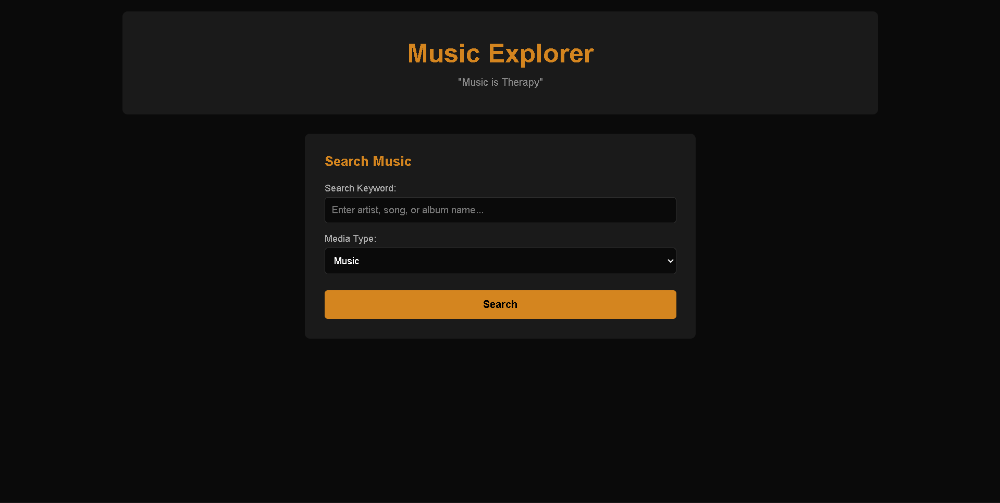
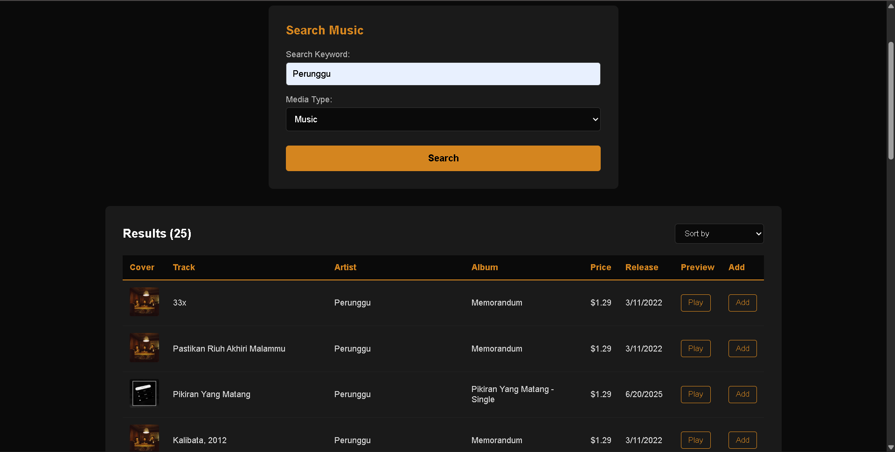
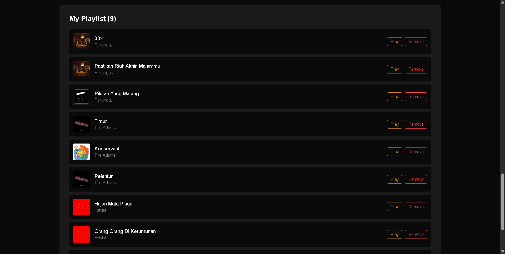
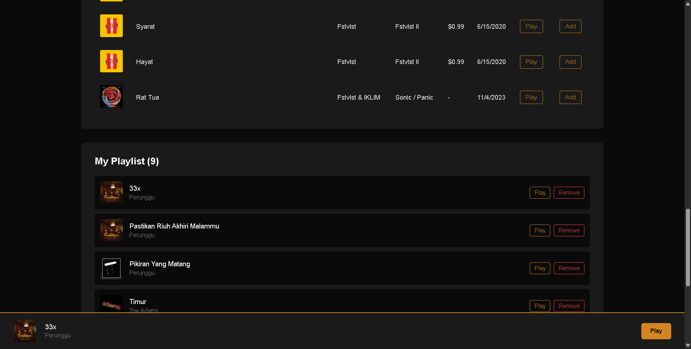

# Music Explorer

Aplikasi pencarian musik menggunakan iTunes Search API dengan fitur playlist builder dan audio preview.

## Identitas Mahasiswa
- **Nama**: Muhammad Nurikhsan
- **NIM**: 123140057
- **Kelas**: RB

## Deskripsi Project
Music Explorer adalah aplikasi web untuk mencari dan menemukan musik dari iTunes Store. Pengguna dapat mencari lagu berdasarkan keyword, mendengarkan preview 30 detik, menambahkan ke playlist pribadi, dan mengurutkan hasil pencarian.

## Fitur Utama
1. **Search Music** - Pencarian musik dengan keyword dan filter media type
2. **Data Table** - Menampilkan hasil pencarian dengan informasi lengkap
3. **Audio Preview** - Preview 30 detik untuk setiap lagu
4. **Playlist Builder** - Menyimpan lagu favorit ke playlist
5. **Sorting** - Mengurutkan berdasarkan tanggal rilis atau harga
6. **localStorage** - Data playlist tersimpan secara permanen

## Tech Stack
- **Frontend**: ReactJS (Vite)
- **API**: iTunes Search API
- **Styling**: CSS
- **State Management**: React Hooks (useState, useEffect)
- **Storage**: localStorage
- **Deployment**: Vercel

## Cara Instalasi dan Menjalankan

### Prerequisites
- Node.js (v18 atau lebih baru)
- npm atau yarn

### Langkah-langkah
```bash
# Clone repository
git clone https://github.com/muhammad-nurikhsan/uts-pemweb-123140057.git

# Masuk ke folder project
cd uts-pemweb-123140057

# Install dependencies
npm install

# Jalankan development server
npm run dev

# Buka browser di http://localhost:5173
```

## Struktur Project
```
uts-pemweb-123140057/
├── public/
├── src/
│   ├── components/
│   │   ├── Header.jsx
│   │   ├── SearchForm.jsx
│   │   ├── DataTable.jsx
│   │   ├── AudioPlayer.jsx
│   │   └── PlaylistBuilder.jsx
│   ├── App.jsx
│   ├── App.css
│   └── main.jsx
├── package.json
└── README.md
```

## Cara Menggunakan

1. **Search**: Masukkan keyword (nama artist, lagu, atau album) dan pilih media type
2. **Play**: Klik tombol "Play" pada kolom Preview untuk mendengarkan lagu
3. **Add to Playlist**: Klik tombol "Add" untuk menambahkan lagu ke playlist
4. **Sort**: Gunakan dropdown untuk mengurutkan hasil pencarian
5. **Remove**: Klik tombol "Remove" di playlist untuk menghapus lagu

## Link Deployment
**Live Demo**: https://uts-pemrogramanaplikasiweb-12314057.vercel.app

## Screenshot

### 1. Halaman Utama


### 2. Hasil Pencarian


### 3. Playlist


### 4. Audio Player


## Fitur yang Diimplementasikan

### Form (CPMK 05.01)
- Form dengan 5 jenis input berbeda
- Validasi HTML5 dan JavaScript
- Form submission dengan state management

### Table (CPMK 05.01)
- Tabel data dinamis dari API
- Minimal 3 kolom informasi
- Data formatting (tanggal dan harga)

### CSS (CPMK 05.01)
- Multiple selector types
- Pseudo-classes untuk interaksi
- Responsive design dengan media queries
- Flexbox layout

### HTML5 (CPMK 05.02)
- Semantic HTML tags
- DOCTYPE HTML5
- Meta tags lengkap

### Modern JavaScript (CPMK 05.02)
- Arrow functions
- Template literals
- Destructuring
- Spread operators
- Array methods (map, filter, sort)
- Async/await

### React (CPMK 05.02)
- Functional components
- useState dan useEffect hooks
- Props passing
- Conditional rendering
- Event handling

### API Integration (CPMK 05.02)
- Fetch data dari iTunes API
- Loading state
- Error handling
- Data transformation

## API yang Digunakan

**iTunes Search API**
- Base URL: `https://itunes.apple.com/search`
- Method: GET
- Parameters:
  - `term`: Search keyword
  - `media`: Media type (music, podcast, etc)
  - `limit`: Number of results

Contoh:
```
https://itunes.apple.com/search?term=coldplay&media=music&limit=25
```

## Browser Support
- Chrome (recommended)
- Firefox
- Safari
- Edge

## Known Issues
- Preview audio hanya 30 detik (limitasi dari iTunes API)
- Beberapa lagu tidak memiliki preview URL

## Kontak
Contact Me:
- Email: muhammad.123140057@student.itera.ac.id
- GitHub: muhammad-nurikhsan